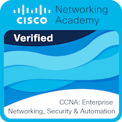
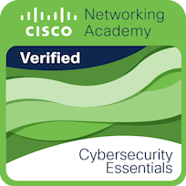
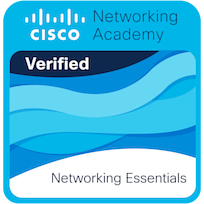
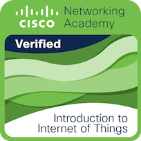

Hello, I'm Jack Orcherton; a final year Bachelor of Science student studying Cyber Security and Ethical Hacking. I am currently looking for graduate jobs in the cyber security industry. I have a keen interest in penetration testing, social engineering and network security. Below shows the modules I have undertaken so far, achieving a first in each:

- Computer Architecture and Networks
- Computer Systems and Networking (CISCO) 1
- Computer Systems and Networking (CISCO) 2
- Digital Forensics Fundamentals
- Ethical Hacking
- Intermediate Digital Forensics
- Introduction to Algorithms
- Introduction to Computing
- Introduction to Computer Security
- Logic and Sets
- Networked System Architectures
- Operating Systems, Security and Networks
- Real World Project
- Secure Programming and Exploit Development
- Technology and its Social, Legal and Ethical Context

If you have any further enquiries about my academic or work-based achievements, please consult my [LinkedIn page](https://www.linkedin.com/in/jack-orcherton/) or [contact me](/contact).

## Comsec
In my spare time, I help to lead an ethical hacking club, in which we organise discussions, in-house tournaments and teach hacking concepts.

One example of this, is I have recently organised an in-house capture the flag tournament for the second year in a row, based on the twelve days of Christmas. This time I focused on the topics of basic steganography, opensource intelligence and cryptography.

We have also competed competitively, like the Reply Challenge CTF, where we achieved 290 out of 2247.

To view some of my work, please head to the [Comsec website](https://cov-comsec.github.io/).

## Other Achievements

### Cisco
I am both Cisco Network Essentials and Cybersecurity Essentials verified; please head to [Credly](https://www.credly.com/users/jack-orcherton/badges) to view my awards.

### TryHackMe
TryHackMe is an ethical hacking learning platform, in which I have reached the highest level (13).

