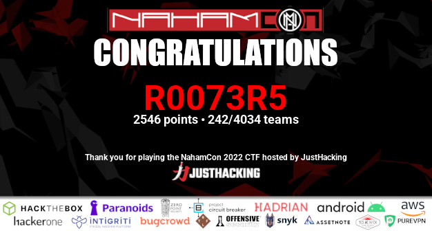
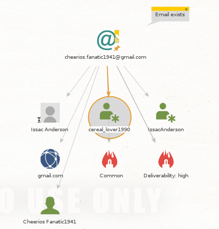

# NahamCon 2022
NahamCon was held this weekend, and as a team of three, we reached 242nd place.



Below will provide a walkthrough of the challenges that I solved.

## Warm-Up Challenges

### Exit Vim
In this challenge, you connected to a machine by SSH and entered the Vim editor. To solve this challenge, you could use ESC, then ':q!'.

## Keeber
Keeber was a set of OSINT challenges.

### Challenge 1
A new company keeber has set up a site, discover the domain and author.

To discover the site, search for Keeber Security Group, and the top result (at least on DuckDuckGo) is https://keebersecuritygroup.com/. To discover the domain author, perform a whois look-up, and a flag is found.

```sh
jack@JOlaptop:~$ whois keebersecuritygroup.com
Domain Name: KEEBERSECURITYGROUP.COM
Registry Domain ID: 2689392646_DOMAIN_COM-VRSN
Registrar WHOIS Server: whois.name.com
Registrar URL: http://www.name.com
Updated Date: 2022-04-15T01:52:49Z
Creation Date: 2022-04-15T01:52:48Z
Registrar Registration Expiration Date: 2023-04-15T01:52:48Z
Registrar: Name.com, Inc.
Registrar IANA ID: 625
Reseller:
Domain Status: clientTransferProhibited https://www.icann.org/epp#clientTransferProhibited
Registry Registrant ID: Not Available From Registry
Registrant Name: flag{ef67b2243b195eba43c7dc797b75d75b} Redacted
```

### Challenge 2
Many employees have left the company, so find an old member of staff.

To solve this, I discovered that the group listed staff members on [/teams](https://keebersecuritygroup.com/teams), therefore I used the [waybackmachine](https://web.archive.org/) to view an archived version of the page. From here, we discover Tiffany Douglas, and there is a flag after her name.

### Challenge 4
The ex-employee also left the company password database exposed to the public through GitHub. Since the password is shared throughout the company, it must be easy for employees to remember. The password used to encrypt the database is a single lowercase word somehow relating to the company. Make a custom word list using the Keeber Security Groups public-facing information, and use it to open the password database The flag is in regular format.

Firstly, we needed to identify where the database was publicly stored, which was [here](https://github.com/keebersecuritygroup/password-manager). Once downloaded it was obvious that we would need to crack it, so I exported the key to a format that John would understand.

```sh
keepass2john ksg_passwd_db.kdbx > ksg_hash.txt
```

Next, a wordlist had to be created, so I used Cewl to crawl through all the website and GitHub repositories belonging to the organisation. As we were told that the password would be all lower case, I used the following command to change everything to this case: `tr a-z A-Z < ./wordlist.txt`

Now I ran John with the following command and waited patiently for the password to be cracked.

```sh
john --wordlist=./wordlist.txt ksg_hash.txt
```

After waiting, we discover that the password is "craccurrelss" and can now open the database to view the flag.

### Challenge 5
Company policy dictates that users should use their company email for commits - Tiffany did not do this for one commit - what is her personal email.

To solve this challenge, you could clone the public repository and use the `git log` command to see commit authors and associated emails. You can find Tiffany’s personal address on commit b25ed7f5aa72f88c0145a3832012546360c2ffc2.

### Challenge 6
We need to find where Tiffany now works, she left a Yelp review of it, and the email from the previous challenge may be of help.

Firstly, I had to create an account on Yelp, and then Yelp provides the ability to find friends via their email. So use the email from the previous challenge. Here we discover her [reviewer page]( https://www.yelp.com/user_details?userid=J8qcU92xWob-RMLxJMt8Pg) and that she has only left one review that contains a flag.

### Challenge 7
Multiple staff have received a phishing email, can you discover who sent it?

From the email, we discover that it was sent by cheerios.fanatic1941@gmail.com; however, I could not find accounts on other social media sites using this handle. Therefore, I used Maltego and ran all transformations, which produced the following graph:



From this graph, we learn that the email address was used to create a [MySpace account](https://myspace.com/cereal_lover1990), which states the account holder's name is Issac Anderson.